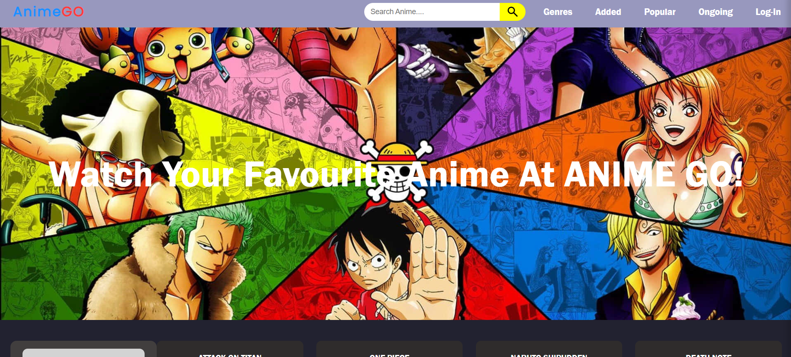
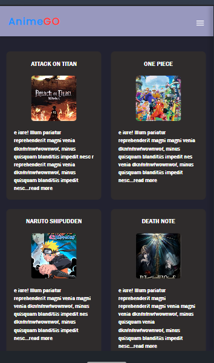

Anime GO – UI Streaming Platform Clone
About

Anime GO is a responsive anime streaming website UI inspired by modern streaming platforms.

This project focuses on layout structuring, responsive design, navigation logic, sidebar implementation, and clean UI presentation using pure HTML, CSS, and JavaScript.

It was originally built as a UI clone project and has now been modified and improved with better responsiveness, cleaner structure, and enhanced mobile behavior.

This project will continue to evolve with future upgrades and UI improvements.

Features

Responsive navigation bar

Sidebar menu for mobile view

Modern hero section

Responsive grid layout

Hover effects and UI transitions

Clean layout structure

Mobile-first improvements

Organized CSS structure

Project Structure / Components

Navbar: Responsive navigation with sidebar toggle
Hero Section: Featured anime banner
Cards Grid: Anime preview layout
Sidebar: Mobile navigation drawer
Responsive CSS: Media queries for different screen sizes

## Screenshots

### Desktop View

### Mobile View

Technologies Used

HTML5

CSS3

JavaScript (Vanilla JS)

Git & GitHub

Learning Outcome

Building structured responsive layouts

Managing flexbox and grid layouts

Implementing sidebar navigation

Handling responsive behavior with media queries

Organizing CSS for scalability

Preparing and deploying a project using GitHub Pages

Live Preview

https://codewithosama03.github.io/anime-website/

Notes

This project focuses purely on frontend UI and layout design.

It is a learning-based clone project and does not include backend functionality or streaming features.

The repository has been updated to a modified and improved version of the original clone.

Future updates will include further UI refinements, better animations, and structural improvements as part of continuous learning and development.
